

Act-0 Results Analysis

Reproducing EEG-VJEPA on TUAB, our FEI+C model, and healthy-vs-stroke classification: eight experiments and a visual check explained

EEE 402 (G1) — Artificial Intelligence and Machine Learning Laboratory Group 01 · Bangladesh University of Engineering and Technology (BUET)

Internal team document. The TUAB numbers come from an unlicensed Kaggle copy and must not be shared outside the group.

Every number, table and figure in this document is generated by <code>docs/act0_results/make_results.py</code> from the saved experiment outputs. No result is typed by hand.

# Results at a glance

**The story in three sentences.**

1. We reproduced the EEG-VJEPA paper's TUAB evaluation faithfully, but the released checkpoints fall far short of the paper, because their representation is **collapsed**: every recording gets almost the same embedding.
2. Our own model, **FEI+C**, is not collapsed. It works on NMT, where it was trained, and it transfers to TUAB, where it performs at least as well as the released ViT-M.
3. On the stroke data, the clinical baseline (BSI) is strong and stable, and FEI+C matches it.

| # | Question | Answer | Key number (reference) |
|---|---|---|---|
| 1 | Do the released checkpoints reach the paper's frozen TUAB AUROC? | **No**, and they lose to random weights | ViT-M {{p14_m42}} (paper 0.877; random ViT-M {{p14_r42}}) |
| 2 | Does fine-tuning the released ViT-M beat training from scratch? | **No** measurable gain | {{ft_fin}} vs {{sc_fin}} (paired p = {{ft_t_p}}; paper 0.885) |
| 3 | Why? Are the released features collapsed? | **Yes**, on TUAB and on stroke | token std {{col_t_rel}} vs {{col_t_rnd}} for random weights |
| 4 | With a simple linear probe, how far do the released features get? | Above band power, not clearly above random weights | {{lp_rel_full}} full train (paper 0.877; band power {{lp_bp_full}}) |
| 5 | Does our FEI+C work on NMT? | **Yes**; both branches add up | FEI+C {{a0_feic}} vs FEI {{a0_fei}} (better in {{a0_w_fei}} folds) |
| 6 | Does FEI+C transfer to TUAB? | **Yes**: ties ViT-M, beats band power | FEI+C {{t6_FEI+C_full}} vs ViT-M {{lp_rel_full}} (Δ {{t6_FEI+C_vs_vit}}, p = {{t6_FEI+C_vs_vit_p}}) |
| 7 | Stroke: is our pipeline sound, and how strong is the clinical BSI baseline? | **Yes**; BSI is strong and stable | BSI {{b_primary_BSI}} primary / {{b_sensitivity_BSI}} sensitivity (LOSO; chance 0.5) |
| 8 | Stroke: with a corrected input prep, how does FEI+C do? | **Matches BSI** | FEI+C {{c_FEIpC}} vs BSI {{c_BSI}} (LOSO; chance 0.5) |
| V | Do t-SNE / UMAP maps of the TUAB features show normal and abnormal clusters? | **No**, for learned and random weights alike | 10-NN label agreement {{v_rfeic_orig}}–{{v_feic_orig}} on the original features (chance {{v_chance}}) |

**Names used throughout.** *ViT-M* and *ViT-B* are the two released EEG-VJEPA checkpoints. *FEI+C* is our two-branch model (FEI = frequency-masked waveform encoder, C = spectrogram-dynamics encoder), explained in the Act-0 teaching guide. *rand-X* means the same network as X with random, untrained weights.

# How to read the numbers

This page explains every metric and test used later. Nothing here is a result.

**AUROC** (area under the ROC curve) is our main metric. Take one random abnormal (or stroke) recording and one random normal (or control) recording. AUROC is the probability that the model gives the abnormal one the higher "abnormal" score. **0.5 is chance, 1.0 is perfect.** It does not depend on any decision threshold. We write it as 0.xxx everywhere. The **ROC curve** plots the true-positive rate against the false-positive rate for every possible threshold; AUROC is the area under it.

**Accuracy, balanced accuracy (BAcc), sensitivity, specificity.** These need a threshold (we always use P = 0.5, never tuned). *Sensitivity* = fraction of abnormal/stroke recordings caught; *specificity* = fraction of normal/control recordings correctly called normal; *BAcc* = their average, which is not fooled by unequal class sizes. **AUC-PR** is the area under the precision-recall curve; its chance level equals the fraction of positives, so it is only comparable within one data set.

**Mean ± sd.** When an experiment is repeated on several training subsets (TUAB) or folds (NMT), we report the mean and the standard deviation across them (population sd). The sd shows how much the result depends on which data were used.

**95 % confidence interval (CI).** Made by the *bootstrap*: the test recordings (or subjects) are resampled with replacement 2,000 times and the metric is recomputed each time. The middle 95 % of those values is the CI. A wide CI means the number is uncertain. For a **difference** between two models (Δ AUROC), both models are scored on the same resamples; if the CI of Δ contains 0, we cannot tell the two models apart.

**p-value.** The probability of seeing a result at least this extreme if there were really no effect. Small p (conventionally < 0.05) means the effect is unlikely to be luck. A large p does **not** prove there is no effect; it means the data cannot show one. For Δ AUROC we report p(Δ ≤ 0): the share of bootstrap resamples in which the first model is not better.

**Which test where.**

- *Mann-Whitney*: compares two groups of numbers without assuming a normal distribution (released runs vs random-weight runs; stroke vs control feature values).
- *Paired t-test / Wilcoxon*: compare two methods run on the **same** subsets (fine-tune vs scratch on s0–s4).
- *Permutation test*: the labels (stroke/control) are shuffled 1,000 times and the whole evaluation is re-run each time. This gives the AUROC values that pure chance produces with this exact pipeline. The p-value is the share of shuffles that did at least as well as the real labels.

**How the stroke models are tested.** There are only 15 subjects, so every scheme holds subjects out:

- *LOSO* (leave-one-subject-out): train on 14 subjects, predict the 15th, repeat for each subject. This was the pre-registered scheme.
- *5-fold ×100*: split subjects into 5 groups, train on 4 and predict 1, and repeat the whole thing with 100 different random splits (the same 100 splits for every model). This shows how much the result depends on the split.
- *LPO* (leave-pair-out): hold out one stroke and one control subject at a time, for all pairs.

**Random-init control.** The most important check in this document. We run the same network with random, untrained weights through exactly the same pipeline. If the pre-trained model does not beat its random twin, the pre-training did not help: the score comes from the architecture and the classifier, not from learned knowledge.

**Collapse.** A known failure of self-supervised training. The encoder learns to give (almost) the same output for every input, which makes its training task trivially easy. We measure it two ways: *token std* (how much the encoder's output varies within a recording) and *mean cosine between recordings* (1.0 means every recording gets the same embedding).

**Frozen, fine-tune, scratch.** *Frozen*: the encoder is fixed and only a small classifier ("head" or "probe") on top is trained. *Fine-tune*: encoder and head are trained together, starting from the pre-trained weights. *Scratch*: the same, but starting from random weights. Fine-tune minus scratch = what pre-training is worth.

**Final vs best epoch.** The paper's recipe trains for 500 epochs with no validation set. We report the **final** epoch as our main number. We also show the *best-epoch** number: the highest test AUROC over all 500 epochs. It is marked with * because it is picked by looking at the test set, so it is optimistic and not a fair result.

# Part A — Reproducing EEG-VJEPA on TUAB

## Experiment 1: frozen reproduction of the paper's TUAB result

**Question.** With the authors' released checkpoints and their own evaluation code, do we get the paper's TUAB AUROC (ViT-M 0.877, ViT-B 0.879)? And did we reproduce their pipeline faithfully?

**Setup.**

| Item | Value |
|---|---|
| Data | TUAB v3.0.1; test = the official eval set (276 recordings, never used for training) |
| Preprocessing | Paper §4.1: 19 channels, first 5 min, 1–40 Hz, 100 Hz, per-channel z-score, 5 s frames every 2.5 s |
| Encoders | Released ViT-M and ViT-B, **frozen**; random-init ViT-M as control (3 seeds) |
| Heads | §4.2 head (the authors' `AttentionClassifier`) and Fig-3 head (`AttentiveClassifier`) |
| Training recipe | Authors' own: 500 epochs, batch 2, lr 1e-3 |
| Training data | 5 class-balanced, patient-disjoint subsets s0–s4 of 546 recordings (as in the paper) |
| Reported | Final-epoch AUROC, mean ± sd over subsets |

**Is our pipeline faithful?**

- We compared our code with the authors' public repository (commit `{{up_commit}}`): **{{up_same}} of {{up_n}} files are byte-identical**.
- The other 5 files ({{up_diff}}) contain only our additions, all switched off by default or not affecting the result: a hardware temperature guard, a per-run random seed (upstream always uses seed 0, so its "5 runs" could not differ), balanced accuracy logged instead of AUPRC, an option to choose the head (default = the authors' head), an option for random-init weights, and a learning-rate scale that is 1 unless explicitly set (never set in Act-0).
- The checkpoints are the authors' released files: SHA-256 ViT-M {{sha_vitm}}, ViT-B {{sha_vitb}}.

**Result.**

{{t:p14}}

*Best-epoch AUROC is optimistic (chosen on the test set); see the primer.

Per-subset final AUROC:

{{t:p14_runs}}

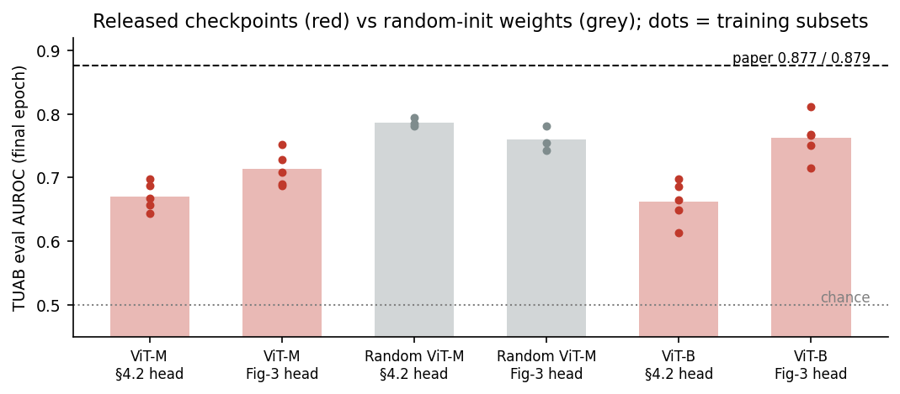

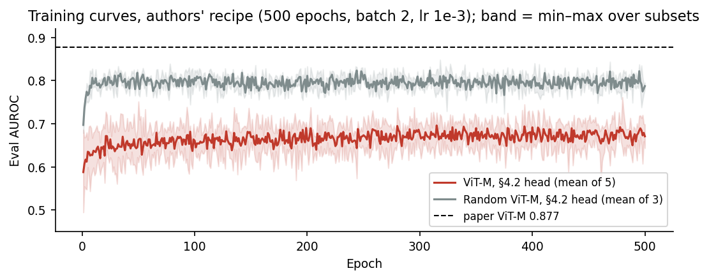

**How to read it.**

- Every released-checkpoint result is far below the paper line. ViT-M with the paper's main head reaches {{p14_m42}}, which is **{{p14_short_m}} below** the paper's 0.877. Even the optimistic best-epoch number ({{p14_m42_best}}) stays far below.
- The grey bars are the surprise: a ViT-M with **random, untrained weights** does better ({{p14_r42}}) than the released pre-trained one.
- The training curves show this is not a matter of training too briefly: the gap is there from the first epochs to epoch 500.

**Is it real?**

- Random weights beat the released ViT-M by {{p14_gap42}} with the §4.2 head (Mann-Whitney p = {{p14_mw42}}) and by {{p14_gap3}} with the Fig-3 head (p = {{p14_mw3}}). Both are significant.
- The two groups touch only at the edge: with the Fig-3 head, the best released run ({{p14_rel_max}}) is slightly above the worst random run ({{p14_rnd_min}}).

> **Takeaway.** The pipeline is faithful, but the released checkpoints do not reproduce the paper. They even lose to random weights, which means the pre-trained features are worse than no pre-training. Experiment 3 shows why.

**Limits.** The paper does not say which 546 recordings form each subset, which epoch it reports, or whether TUAB-eval was seen in pre-training; our choices were fixed in advance. Only 3 random-init seeds were run.

## Experiment 2: fine-tuning vs training from scratch

**Question.** The paper also reports fine-tuning the whole ViT-M (AUROC 0.885). Does starting from the released weights help compared with training the same network from random weights?

**Setup.**

| Item | Value |
|---|---|
| Network | ViT-M + §4.2 head, **all weights trained** |
| Start | Fine-tune = released checkpoint; scratch = random weights |
| Recipe | Authors' fine-tune config: 500 epochs, batch 2, lr 1e-3 (cosine to 0), weight decay 1e-3 |
| Precision | **bf16 — a labelled deviation** (upstream uses full precision); chosen for speed and used for all 10 runs |
| Data / test | Subsets s0–s4 / official eval set, paired by subset |

**Result.**

{{t:ft}}

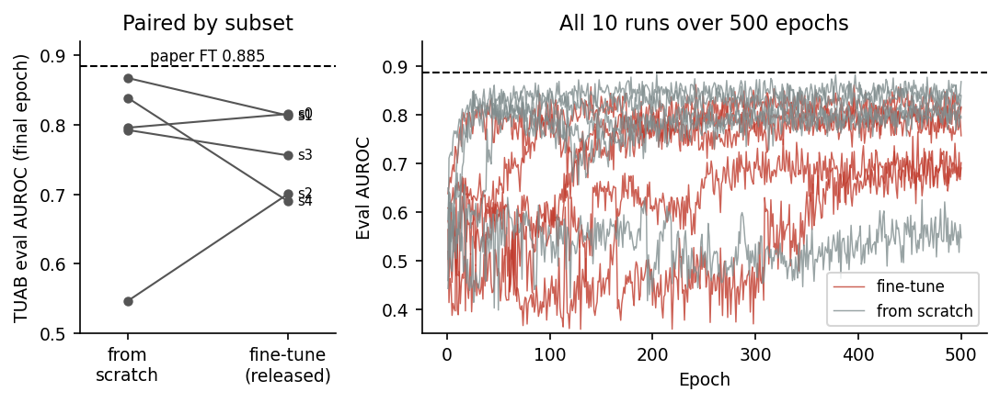

**How to read it.**

- Fine-tune ({{ft_fin}}) and scratch ({{sc_fin}}) are the same within noise. Fine-tuning wins on {{ft_wins}} subsets; the mean difference is {{ft_delta}}.
- The right panel shows why the spread is so large: with lr 1e-3 and batch 2, several runs spend long stretches predicting "normal" for every recording (up to {{ft_maj_max}} epochs, last table row) before recovering as the learning rate decays.

**Is it real?** No difference can be shown: paired t-test p = {{ft_t_p}}, Wilcoxon p = {{ft_w_p}}. The best-epoch* numbers ({{ft_best}} vs {{sc_best}}) tell the same story.

> **Takeaway.** Under the authors' released recipe, the released pre-training is worth nothing measurable: the network does as well from random weights. This fits the collapse found in Experiment 3.

**Limits.** bf16 is a deviation from the upstream config. The paper's own §5 says its fine-tuning "benefited from lower learning rates and partial unfreezing", so the recipe behind its 0.885 is probably not the released config and was never published. The very large seed spread means 5 subsets can only detect big differences.

## Experiment 3: the released encoder is collapsed

**Question.** Why do the released features lose to random ones? We test whether the encoder gives the same output for every recording (collapse).

**Setup.** Released ViT-M and random-init ViT-M (3 seeds), frozen, on the 276 TUAB eval recordings and the 15 primary stroke subjects (Part C). For each recording we measure the token std and the cosine similarity between every pair of recordings.

**Result.**

{{t:collapse}}

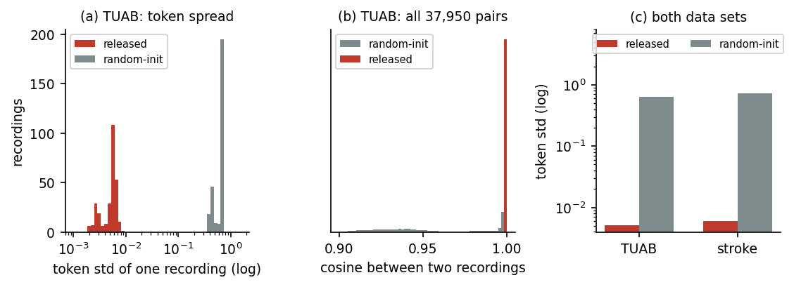

**How to read it.**

- (a) The released encoder's outputs barely vary: its token std is about **{{col_ratio_t}} times smaller** than for random weights on TUAB ({{col_ratio_s}} times on stroke).
- (b) Almost every pair of TUAB recordings has cosine ≈ 1 with the released encoder (mean {{col_t_cos_rel}}): normal and abnormal recordings look the same to it. Random weights keep recordings apart (mean {{col_t_cos_rnd}}).
- (c) The same happens on the stroke data, which the encoder never saw.

**Is it real?** The two groups do not overlap at all: the largest released token std of any recording is {{col_rel_tmax}}, the smallest random one is {{col_rnd_tmin}}.

> **Takeaway.** The released checkpoints are collapsed. A classifier on top has almost no information to work with, which explains Experiments 1 and 2. This is a property of the checkpoint, not of our input: it appears on TUAB and on a completely different data set (stroke).

**Limits.** Collapse metrics show that the features carry little information; they cannot tell us *why* the authors' pre-training collapsed.

## Experiment 4: the simplest possible probe

**Question.** If the collapsed features still contain a small signal, can a very simple classifier find it? We also add a classical, hand-crafted baseline (band power) as a reference.

**Setup.**

| Item | Value |
|---|---|
| Features | Released ViT-M (frozen): token mean + token std, averaged over the recording (768 numbers); random-init ViT-M (3 seeds); band power (hand-crafted relative power per channel and band) |
| Classifier | StandardScaler + logistic regression (C = 1, balanced classes) |
| Training data | Subsets s0–s4, and the full TUAB training set (2,717 recordings) |
| Test | Official eval set (276) |

**Result.**

{{t:lp}}

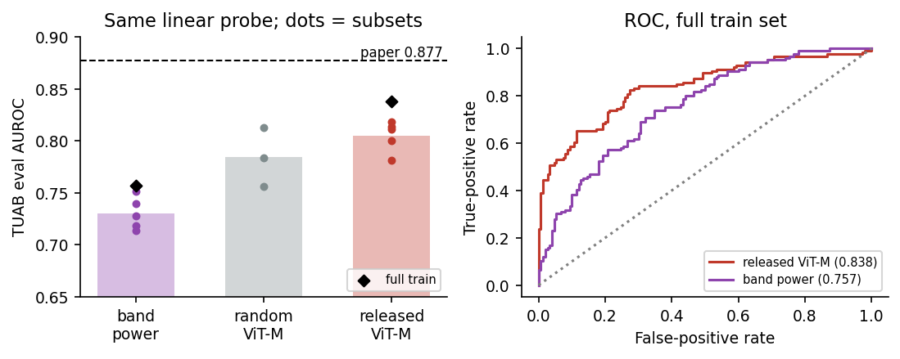

**How to read it.**

- The simple probe does much better than the paper's head in Experiment 1 ({{lp_vs_p14}} higher on the same subsets). A likely reason: StandardScaler re-scales every feature to spread 1, which blows the tiny remaining differences back up.
- Trained on all 2,717 recordings, the released ViT-M reaches {{lp_rel_full}}, the best released-checkpoint number we have. It is still **{{lp_short}} short** of the paper's 0.877.
- Both ViT-M variants beat band power.

**Is it real?**

- Released vs random weights on the subsets: {{lp_rel}} vs {{lp_rnd}}, Mann-Whitney p = {{lp_rel_rnd_p}}. The released weights are **not** clearly better than random ones.
- The full-train CI {{lp_rel_full_ci}} is wide enough to include the paper's 0.877, so this single number cannot rule the paper out on its own. On the paper's own protocol (the 5 subsets), every run is below 0.877 (table above).

> **Takeaway.** Even with the most forgiving probe, the released checkpoint does not reach the paper, and it cannot be told apart from random weights. This number ({{lp_rel_full}}) is the fair ViT-M reference for our own model in Experiment 6.

**Limits.** The band-power feature set is simple (relative power only); a richer hand-crafted set would likely score higher. Only 3 random seeds.

# Part B — Our model: FEI+C

The released EEG-VJEPA could not serve as a working pre-trained encoder, so we used our own two-branch model, FEI+C, built earlier on NMT. Part B checks that it is healthy where it was trained (NMT) and that it transfers to TUAB.

## Experiment 5: FEI+C on NMT

**Question.** Does FEI+C, in the exact configuration used in Act-0, work on NMT? Do both branches contribute?

**Setup.**

| Item | Value |
|---|---|
| Data | NMT normal/abnormal, {{a0_n}} recordings ({{a0_npos}} abnormal) |
| Protocol | 5-fold cross-validation (seed 0), recording level; each fold's encoders were pre-trained only on that fold's training recordings |
| Encoders | Plain FEI (20 s windows) and Branch C (20 s windows), frozen |
| Classifier | StandardScaler + logistic regression (C = 1, balanced) |
| Arms | FEI alone, C alone, FEI+C (the two feature vectors joined) |

**Gate: are we loading the encoders correctly?** Before computing new numbers, we re-ran the older, already-recorded FEI configuration (5 s windows) with the same loading code. It reproduces every recorded fold AUROC within {{a0_gate_maxdev}}:

{{t:a0_gate}}

**Result.**

{{t:a0}}

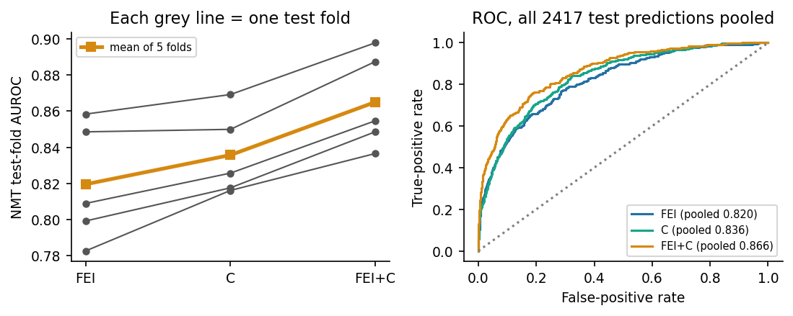

**How to read it.** C alone is better than FEI alone, and joining them is better than either: every grey line rises from left to right.

**Is it real?** FEI+C beats FEI by {{a0_d_fei}} (in {{a0_w_fei}} folds) and beats C by {{a0_d_c}} (in {{a0_w_c}} folds). BAcc ({{a0_feic_bacc}}) and AUC-PR ({{a0_feic_pr}}) improve in the same way.

> **Takeaway.** FEI+C works on NMT, and the two branches carry different information: C adds to FEI in every fold.

**Limits.** No random-init control was run for this configuration on NMT, so we can say that the two branches add up, but not how much of that comes from pre-training. With 5 folds, "better in every fold" is the strongest evidence available, but it is not a formal significance test.

## Experiment 6: FEI+C transferred to TUAB

**Question.** FEI+C was built on NMT (Pakistan). Does it transfer to TUAB (USA), a different hospital and population? How does it compare with the released ViT-M under the **same** probe, and does its pre-training beat random weights?

**Setup.**

| Item | Value |
|---|---|
| Data / test | TUAB, official eval set (276), same subsets s0–s4 and full train set as Experiment 4 |
| FEI+C input prep | 19 channels, first 20 min, 0.5–40 Hz, 200 Hz, per-channel z-score |
| FEI | The 5 NMT-pretrained fold encoders |
| C and FEI+C | Encoders pre-trained on NMT **plus the unlabelled TUAB training recordings** ("NMT+TUAB-train pretrained"), so C sees its own input distribution. The FEI inside this FEI+C is the jointly pre-trained FEI. TUAB-eval was never used in pre-training |
| Controls | Random-init FEI, C and FEI+C (3 seeds) |
| Classifier | Same probe as Experiment 4; the 5 fold encoders' predictions are averaged |
| Comparisons | Paired bootstrap Δ AUROC on the 276 eval recordings |

**Result.**

{{t:t6}}

"Full train, single encoders" = the mean ± sd of the 5 fold encoders scored one at a time, instead of averaged.

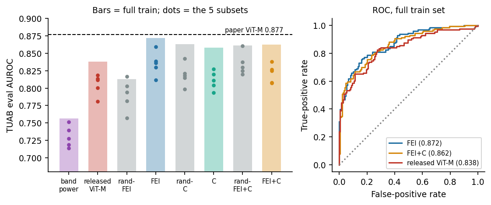

**Are the encoders healthy?** Unlike the released ViT-M, both FEI+C encoders keep recordings apart:

{{t:t6_col}}

**How to read it.**

- Every FEI+C variant is well above band power ({{t6_FEI+C_full}} vs {{lp_bp_full}}).
- FEI+C and the released ViT-M are close: {{t6_FEI+C_full}} vs {{lp_rel_full}}.
- FEI alone is the highest bar ({{t6_FEI_full}}).
- The C and FEI+C bars are almost exactly as high as their random-init twins.

**Is it real?**

- **FEI+C vs released ViT-M** (the planned comparison): Δ {{t6_FEI+C_vs_vit}}, CI {{t6_FEI+C_vs_vit_ci}}, p = {{t6_FEI+C_vs_vit_p}}. **A tie**: FEI+C is at least as good as ViT-M, but not shown to be better.
- **FEI vs released ViT-M** (not pre-declared): Δ {{t6_FEI_vs_vit}}, CI {{t6_FEI_vs_vit_ci}}, p = {{t6_FEI_vs_vit_p}}, higher on {{t6_FEI_vs_vit_subw}} subsets. Borderline; because this comparison was chosen after seeing the results, treat it as a hint, not a claim.
- **FEI vs rand-FEI**: Δ {{t6_FEI_vs_rand}}, CI {{t6_FEI_vs_rand_ci}}, p = {{t6_FEI_vs_rand_p}}. **Significant**: FEI's NMT pre-training carries over to TUAB.
- **C vs rand-C**: Δ {{t6_C_vs_rand}}, CI {{t6_C_vs_rand_ci}}, p = {{t6_C_vs_rand_p}}. **FEI+C vs rand-FEI+C**: Δ {{t6_FEI+C_vs_rand}}, p = {{t6_FEI+C_vs_rand_p}}. No gain from pre-training.
- FEI's operating point on the full train set: BAcc {{t6_fei_bacc}}, sensitivity {{t6_fei_sens}}, specificity {{t6_fei_spec}}.

> **Takeaway.** FEI+C is healthy and transfers to a new hospital: it ties the released ViT-M and beats band power. Inside FEI+C, the pre-training that transfers is FEI's. C helps on its home data (Experiment 5), but off-domain a random-init C does just as well, so C's value on TUAB comes from its spectrogram input and architecture, not from what it learned.

**Limits.** TUAB is internal-only (licence). Only 3 random-init seeds. The FEI result is post-hoc. The C and FEI+C encoders saw unlabelled TUAB training data during pre-training, while FEI did not.

## Visual check: t-SNE and UMAP maps

**Question.** The proposal promised 2-D maps of the learned features, and the paper's Figure 4 shows a UMAP in which normal and abnormal recordings form separate groups. Do our saved TUAB features show that?

**Setup.**

| Item | Value |
|---|---|
| Recordings | TUAB eval set: {{v_n}} recordings ({{v_nab}} abnormal); coloured by the task label only |
| Features | The saved embeddings from Experiments 4 and 6, one encoder each: released ViT-M, random-init ViT-M (seed 0), FEI+C (fold-0 encoder), rand-FEI+C (seed 0) |
| Scaling | StandardScaler, the same as the linear probe |
| t-SNE | scikit-learn, perplexity 30, PCA initialisation, random_state 0 |
| UMAP | umap-learn, 15 neighbours, min_dist 0.1, random_state 0 |
| Check number | {{v_k}}-NN agreement: for each recording, the share of its {{v_k}} nearest neighbours that have the same label, averaged. Computed on the original features and on each map. Chance = {{v_chance}} |

**Result.**

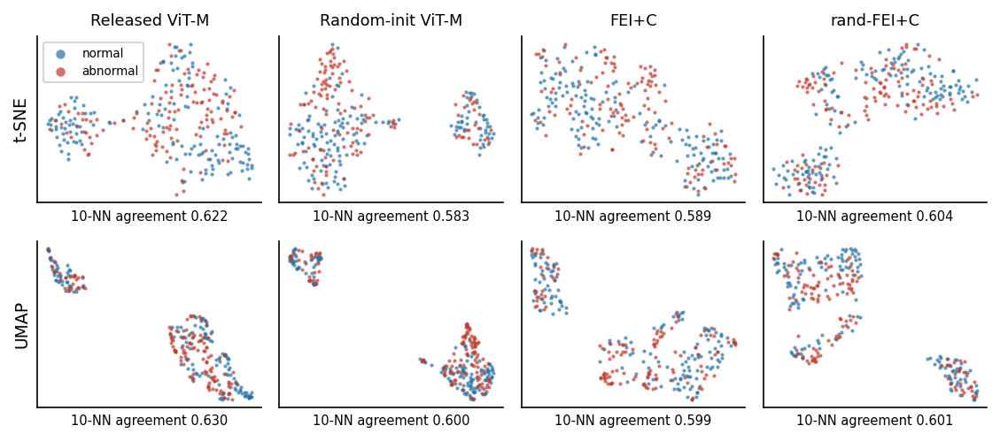

{{t:vmap}}

**How to read it.**

- No map shows a normal group and an abnormal group. Blue and red are mixed everywhere.
- Every map, including both random-init ones, splits into separate islands, and every island holds both labels. The islands therefore come from some property of the recordings or their preparation, not from the diagnosis. We did not identify that property.
- The {{v_k}}-NN agreement is about 0.6 for all four feature sets, against {{v_chance}} for chance. Neighbourhoods are only weakly organised by the label, even though a linear probe on the same features reaches an AUROC of {{lp_rel_full}} (ViT-M, Experiment 4) and {{t6_FEI+C_full}} (FEI+C, Experiment 6). The label is carried by a direction that the probe finds, not by the overall layout that a 2-D map draws.
- The released ViT-M is collapsed (Experiment 3: token std {{col_t_rel}} vs {{col_t_rnd}} for random weights), yet its standardised map looks just as structured as the others. Standardising stretches its tiny differences back up to full size. A map therefore cannot reveal collapse; the collapse metrics of Experiment 3 are the test for that.

**Is it real?** The maps and agreement numbers describe the saved features exactly; they are not a test. On the original features, learned weights score slightly above their random twins ({{v_feic_orig}} vs {{v_rfeic_orig}} for FEI+C, {{v_rel_orig}} vs {{v_rnd_orig}} for ViT-M). We did not test these gaps, so they are not a claim.

> **Takeaway.** The proposal's t-SNE / UMAP deliverable is done. On TUAB, none of the maps shows the class groups of the paper's Figure 4, for the released checkpoint or for FEI+C, and random weights give maps that look just as organised. The classification results come from the probes of Experiments 4 and 6, not from these pictures.

**Limits.** One encoder and one seed per feature set (Experiment 6 averages five encoders). Layouts depend on the map settings, which the paper does not publish. The paper also colours by age and sex; we use the task label only. The stroke cohort (15 subjects) is too small for maps.

# Part C — Healthy vs stroke

The proposal's Part 2: classify healthy controls vs stroke patients (Zenodo 19599466) with frozen encoders plus the Brain Symmetry Index (BSI), a clinical measure of left-right power asymmetry. This part reports the clinical baseline (BSI) and our FEI+C.

## Experiment 7: pipeline gate and the BSI baseline

**Question.** (a) Is our stroke data pipeline sound: does it show the known clinical effect? (b) How well does the clinical BSI measure alone separate stroke patients from controls under the pre-registered leave-one-subject-out test? This is the reference any learned model has to match.

**Setup.**

| Item | Value |
|---|---|
| Primary cohort | 9 stroke patients vs 6 healthy controls, fixed {{gate_rest_s}} s resting block |
| Sensitivity cohort | All 18 pre-rehabilitation recordings (10 stroke, 8 control), first 300 s |
| Gate (pre-declared) | Broadband BSI (1–30 Hz) higher in stroke, Mann-Whitney p < 0.05 |
| BSI features | Pairwise-derived BSI over 6 central left/right channel pairs, broadband + 4 bands (5 numbers) |
| Classifier / CV | StandardScaler + logistic regression (C = 1, balanced), leave-one-subject-out; threshold 0.5 |
| Statistics | Bootstrap CI over subjects; 1,000-permutation p |

**(a) Gate result: {{gate_primary_pass}}** in both cohorts (primary p = {{gate_primary_p}}, sensitivity p {{gate_sensitivity_p}}). {{gate_n_sig}} of {{gate_n_feat}} classical features differ significantly in the primary cohort, in the expected directions.

{{t:gate}}

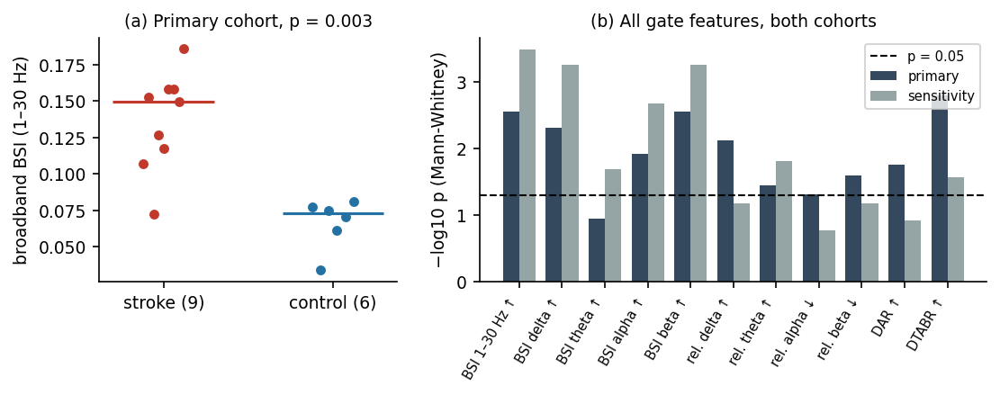

**(b) BSI classifier, LOSO.**

Primary cohort:

{{t:loso_primary}}

Sensitivity cohort:

{{t:loso_sensitivity}}

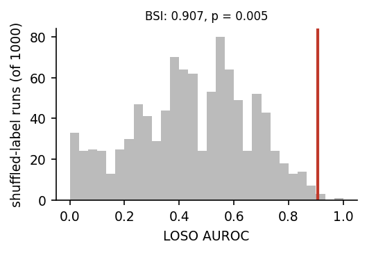

**How to read it.**

- BSI alone reaches {{b_primary_BSI}} on the primary cohort and {{b_sensitivity_BSI}} on the sensitivity cohort: strong, and stable when the cohort and recording segment change.
- The shuffled-label AUROCs centre around {{b_primary_BSI_nullmean}}, slightly below 0.5, because leave-one-out AUROC is biased a little low with so few subjects. The real result sits far in the right tail.

**Is it real?** Yes. BSI beats shuffled labels in both cohorts: permutation p = {{b_primary_BSI_p}} (primary) and {{b_sensitivity_BSI_p}} (sensitivity). The CIs ({{b_primary_BSI_ci}} and {{b_sensitivity_BSI_ci}}) are wide because of the small cohorts.

> **Takeaway.** The pipeline is sound: the classical stroke effect is clearly there, and BSI alone is a strong, stable classifier. It is the bar for FEI+C in Experiment 8.

**Limits.** Only 15 (18) subjects, so every CI is wide.

## Experiment 8: FEI+C on stroke with an NMT-matched input

**Question.** Our FEI+C encoders were pre-trained on NMT. When the stroke recordings are prepared so that their spectrum matches NMT's, how does FEI+C compare with BSI and with its random-init twin? And are the results robust to the choice of cross-validation?

The input preparation for FEI+C was corrected to match NMT's spectrum before this analysis (post-hoc).

**Setup.**

| Item | Value |
|---|---|
| Cohort | Primary (9 stroke vs 6 control) |
| FEI+C input prep | Bad-channel interpolation → average reference → 19 channels → 200 Hz, no band-pass → z-score → one fixed, label-free, per-channel filter per cohort that maps the cohort's mean spectrum onto the NMT training mean ({{g_nref}} recordings) → z-score → 2.5 s frames. Design fixed in writing before any run |
| Encoders | The 5 NMT-only FEI+C fold encoders (unchanged); random-init FEI+C (3 seeds) |
| Classifier | Same as Experiment 7 |
| CV schemes | LOSO (with 1,000-permutation p), 5-fold ×100 (same 100 splits for every arm), leave-pair-out |
| Reference | BSI predictions from Experiment 7 |

**Input gates (thresholds fixed in advance).** These check that the stroke input now looks like NMT to the encoders:

{{t:gates}}

**Result.**

{{t:clean}}

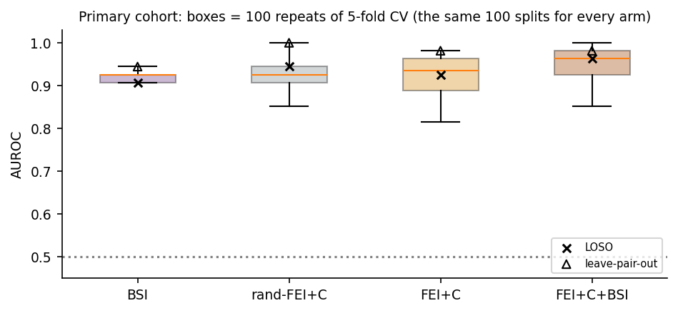

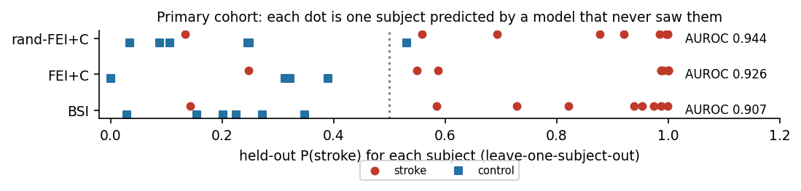

FEI+C operating point (LOSO, threshold 0.5): {{c_FEIpC_op}}.

Paired comparisons:

{{t:clean_pairs}}

**How to read it.**

- All gates pass: the stroke spectrum follows NMT's closely, C's inputs stay well inside range (max {{g_bnz}}, NMT itself {{g_bnz_nmt}}), and C's embeddings are spread out ({{g_c_stroke}} vs {{g_c_nmt}} on NMT and {{g_c_rand}} for random weights), so C is not collapsed.
- FEI+C reaches {{c_FEIpC}} (LOSO), permutation p = {{c_FEIpC_p}}. It misclassifies one stroke subject and no control.
- FEI+C and BSI are level under every CV scheme; FEI+C+BSI is higher than BSI in {{cp_FEIpCpBSI__BSI_kfw}} of the 100 repeats.

**Is it real?**

- **FEI+C vs BSI**: Δ {{cp_FEIpC__BSI}}, CI {{cp_FEIpC__BSI_ci}} (LOSO); better in {{cp_FEIpC__BSI_kfw}} of repeats. **FEI+C matches BSI.**
- **FEI+C vs rand-FEI+C**: Δ {{cp_FEIpC__rand_FEIpC}}, CI {{cp_FEIpC__rand_FEIpC_ci}}; better in {{cp_FEIpC__rand_FEIpC_kfw}} of repeats. **A tie**: on stroke, FEI+C's pre-training shows no measurable gain as a whole.

**Which branch carries the pre-training? (exploratory)**

{{t:clean_branch}}

- FEI beats rand-FEI in {{cb_FEI_kfw}} of the 5-fold repeats (Δ {{cb_FEI_kf}}). FEI's score is at the 1.0 ceiling with only 15 subjects in a post-hoc arm, so this is not a claim. The leave-pair-out test cannot separate them (p = {{cb_FEI_lpo_p}}) because rand-FEI is also near the ceiling.
- C does not beat rand-C (better in {{cb_C_kfw}} of repeats), the same pattern as on TUAB (Experiment 6).

> **Takeaway.** With an input that matches its training data, FEI+C is healthy on stroke and **matches the clinical BSI baseline**. As on TUAB, the pre-training that carries over is FEI's, not C's; as a whole, FEI+C ties its random-init twin.

**Limits.** The prep correction is post-hoc (designed and written down before running, but after the first results). Primary cohort only. 15 subjects: all CIs are wide and ceiling effects are possible. "% of repeats" re-splits the same 15 subjects, so it shows robustness to the split, not significance.

# Conclusions

**Proposal aims and what happened.**

| Proposal aim | Status | Evidence |
|---|---|---|
| Part 1: reproduce the paper's frozen TUAB results with the released checkpoints | **Done faithfully; result not reproduced** | Pipeline {{up_same}}/{{up_n}} files identical to upstream; ViT-M {{p14_m42}} vs paper 0.877; best released number {{lp_rel_full}} (Exps 1, 4) |
| Explain the shortfall | **Achieved** | Released checkpoints are collapsed on TUAB and stroke (Exp 3); they lose to or tie random weights (Exps 1, 4) |
| Added: fine-tuning the released ViT-M | **Done; no gain from pre-training** | Fine-tune {{ft_fin}} vs scratch {{sc_fin}}, p = {{ft_t_p}} (Exp 2) |
| Changed: FEI+C as a working pre-trained encoder | **Achieved** | Healthy on NMT ({{a0_feic}}, Exp 5); transfers to TUAB and ties ViT-M ({{t6_FEI+C_full}} vs {{lp_rel_full}}, Exp 6); FEI's pre-training transfers (p = {{t6_FEI_vs_rand_p}}) |
| Part 2: healthy vs stroke with frozen encoders + BSI, LOSO | **Done** | Gate passed (p = {{gate_primary_p}}); BSI {{b_primary_BSI}} (Exp 7); FEI+C {{c_FEIpC}} matches BSI (Exp 8) |
| Deliverable: t-SNE / UMAP of learned features | **Done** | No class groups in any TUAB map, learned or random; 10-NN agreement {{v_feic_orig}} for FEI+C vs chance {{v_chance}} (Visual check) |
| Our own EEG-VJEPA pre-training | **Dropped** | Out of scope by team decision (2026-09-26) |

**What we can claim.**

1. The released EEG-VJEPA checkpoints do not reproduce the paper's TUAB results, and the reason is representation collapse, not our pipeline.
2. FEI+C is a healthy pre-trained encoder that transfers across hospitals: on TUAB it ties the released ViT-M and beats band power, and its FEI branch's pre-training significantly beats random weights.
3. On stroke, FEI+C matches the clinical BSI baseline.

**What we cannot claim.** That FEI+C beats ViT-M on TUAB (a tie); that FEI+C's pre-training helps on stroke (it ties random weights); that any model beats BSI on stroke (no comparison is significant); any external benchmark (TUAB numbers are internal; the stroke data set has no published classification benchmark to compare against).

**Overall limits.**

- **TUAB licence.** Our copy is unlicensed; TUAB numbers are for internal use only.
- **Small stroke cohort.** 15 (primary) and 18 (sensitivity) subjects; every stroke CI is wide.
- **Demographic confound.** Per the Zenodo 19599466 record description, the stroke patients (55.9 ± 14.2 years, 6 male / 4 female) are older and more often male than the controls (46.3 ± 23.6 years, 1 male / 6 female). Encoders can read age and sex from EEG, so part of any stroke-vs-control score may reflect these differences rather than stroke.
- **Post-hoc elements.** The clean stroke prep (Exp 8) and the FEI-vs-ViT-M comparison (Exp 6) were decided after first results.
- **Few seeds.** Random-init controls use 3 seeds; the NMT configuration (Exp 5) has no random-init control.
- **Unpublished details.** The paper does not specify its subsets, reported epoch or fine-tune recipe.

# Appendix: where the numbers come from

All numbers are produced by `docs/act0_results/make_results.py`, which reads only saved outputs and asserts that its re-computations match the stored summaries. Main sources (under `code/runs/`):

| Experiment | Saved outputs |
|---|---|
| 1 | `tuab_cached/c_vit{m,b}_{frozen,attentive}_s*`, `c_vitm_rand*_s*` (per-epoch CSV + final predictions) |
| 2 | `tuab_finetune/{ft,scratch}_vitm_s*_bf16` |
| 3 | `act0/tuab_vitm_linear/results.json` + eval features; `act0/phaseB/collapse_primary.json` + embeddings |
| 4 | `act0/tuab_vitm_linear/`, `act0/p13_bandpower/` |
| 5 | `act0/a0_feic_nmt/` |
| 6 | `act0/tuab_feic/` (FEI, rand-FEI), `act0/tuab_feic_joint/` (C, FEI+C and their random controls) |
| 7 | `act0/phaseB/` (gate, LOSO, permutations) |
| 8 | `act0/phaseB_clean/`, `act0/phaseB_cv/` |
| V | `act0/tuab_vitm_linear/feats_{released,rand0}_eval.npz`, `act0/tuab_feic_joint/emb_*_{f0,rand0}.npy` |
